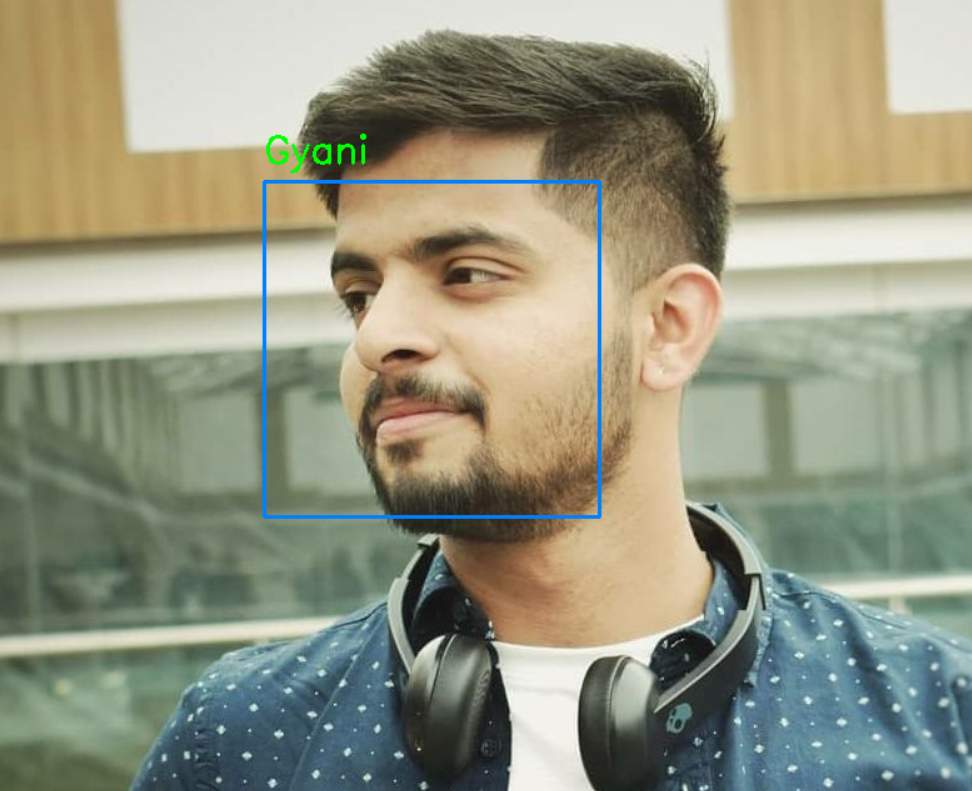
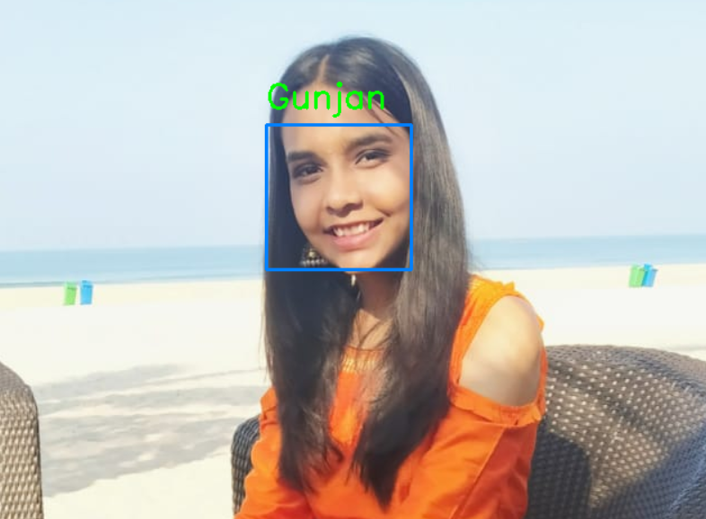
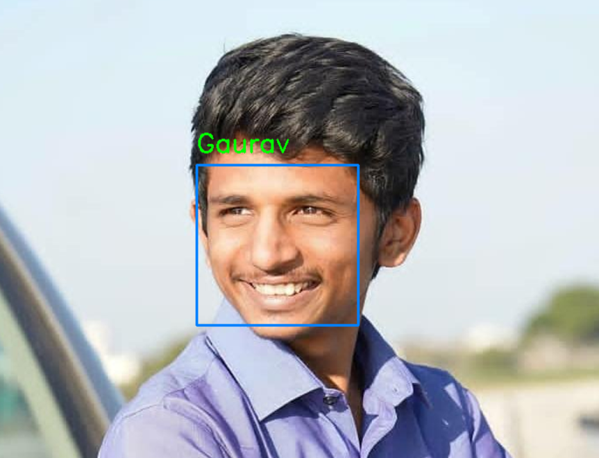

# Face Recognition
During my second year in BCA, I worked on a mini project as a beginner. I gathered a collection of my friends' images, extracted their facial encodings, and trained them using our model. With this, I was able to make accurate predictions for facial recognition.
# Outputs

</img>
</img>
</img>
